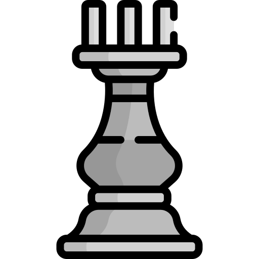
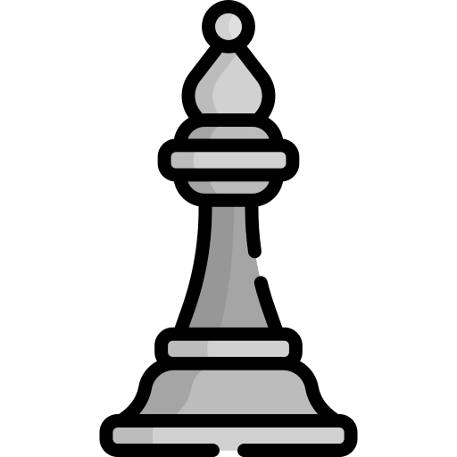

<!--👋HELLO EVERYBODY / 🌐WEBSITE: https://readme-typing-svg.herokuapp.com/demo/ -->
<p align="center">

<!--🖼️GUMP-->
<p align="center">

<!--📏LINE-->
 
<!--🖼️ILOVEOPENSOURCE-->

<!--🎵SPOTIFY / 🌐WEBSITE: https://github.com/kittinan/spotify-github-profile -->
<p align="center">

<!--🦜PARROTSEMOJI / 🌐WEBSITE: https://github.com/seanprashad/slackmoji/ --> 
<p align="center">


<p align="center">
<!--🖼️FUNCUSTOMIZING-->

<!--🔳TERMINAL / 🌐WEBSITES: https://github.com/asciinema/asciinema & https://github.com/dstein64/gifcast -->

<!--📏LINE-->
<p align="center">
 
<!--📰RSS / TAKE IMAGE FROM https://github.com/trinib/trinib/blob/main/.images/marquee.svg TO YOUR REPO AND EDIT IT--> 
<p align="center">
 
<!--🎨ASCIIART / 🌐WEBSITES: https://asciiart.website/ & https://github.com/github/markup/issues/1440#issuecomment-803889380 -->
<h4 align="center"> 

 ```diff
+@ @ @ @ @ @ @ @ @ @ @ @ @ @ @ @ @ @ @ @ @ @ @ @ @ @ @ @+
@@       o o                                           @@
@@       | |                                           @@
@@      _L_L_                                          @@
@@   ❮\/__-__\/❯ Programming isn't about what you know @@
@@   ❮(|~o.o~|)❯  It's about what you can figure out   @@
@@   ❮/ \`-'/ \❯                                       @@
@@     _/`U'\_                                         @@
@@    ( .   . )     .----------------------------.     @@
@@   / /     \ \    | while( ! (succed=try() ) ) |     @@
@@   \ |  ,  | /    '----------------------------'     @@
@@    \|=====|/                                        @@
@@     |_.^._|                                         @@
@@     | |"| |                                         @@
@@     ( ) ( )   Testing leads to failure              @@
@@     |_| |_|   and failure leads to understanding    @@
@@ _.-' _j L_ '-._                                     @@
@@(___.'     '.___)                                    @@
+@ @ @ @ @ @ @ @ @ @ @ @ @ @ @ @ @ @ @ @ @ @ @ @ @ @ @ @+
```
</h4>
<!--💬🃏FUNFACT / 🌐https://github.com/siddharth2016/quote-readme#update-your-readme -->
<p align="center">
<b>FUN FACT🤔 :</b>
<!--STARTS_HERE_QUOTE_README-->
<i>❝Computers have memory or RAM, which stores items on the computer when they’re not in use. The processor stores everything your computer needs to run.❞</i>
<!--ENDS_HERE_QUOTE_README-->
<!--📰RSS-->
<p align="center">

<!--📏LINE-->

<!--📊💬STATTEXT / 🌐WEBSITE: https://textanim.com/ -->
<p align="center">

<!--📊STATSGRAPH / 🌐WEBSITE: https://github.com/anuraghazra/github-readme-stats -->
<p align="center">

<!--📙LANGUAGES / 🌐WEBSITE: https://github.com/anuraghazra/github-readme-stats -->
<p align="center">

<!--📈ACTIVITYGRAPH / 🌐WEBSITE: https://github.com/Ashutosh00710/github-readme-activity-graph#customization -->
<p align="center">

<!--🐍💬SNAKETEXT / 🌐WEBSITE: https://textanim.com/ -->
<p align="center">

<!--🐍📈SNAKEGRAPH / 🌐WEBSITE: https://github.com/Platane/snk -->

<!--📏LINE-->
 
<!--🤣JOYEMOJI / 🌐WEBSITE: https://github.com/seanprashad/slackmoji/ -->
<p align="center">

<!--😂💬JOKETEXT / 🌐WEBSITE: https://textanim.com/ -->
<p align="center">

<!--😂🃏JOKECARD-->
<p align="center">

<!--🍷WINEEMOJI / 🌐WEBSITE: https://github.com/seanprashad/slackmoji/ -->
<p align="center">

<!--💬QUOTESTEXT / 🌐WEBSITE: https://textanim.com/ -->
<p align="center">

<!--💬🃏QUOTESCARD-->
<p align="center">

<!--😻CATEMOJI / 🌐WEBSITE: https://github.com/seanprashad/slackmoji/ -->
<p align="center">

<!--💬🃏MEMESTEXT / 🌐WEBSITE: https://textanim.com/ -->
<p align="center">

<!--🃏MEMESCARD-->
<p align="center">

<!--🔄REFRESHPAGE / 🌐WEBSITE: https://textanim.com/ -->
<p align="center"><a href="https://github.com/trinib/trinib"></a>
<!--📏LINE-->
  
<!--🐱CAT-->
<p align="center">

<!--🤔INTERESTTEXT-->
<p align="center">

<!--🖼️🖼️INTERSTLOGOS-->
<p align="center">


<!--👀VIEWS / 🌐WEBSITE: https://github.com/antonkomarev/github-profile-views-counter -->
<p align="center">

</h4>
<!--🏆TROPHY / 🌐WEBSITE: https://github.com/ryo-ma/github-profile-trophy -->
<p align="center">

<!--📉METRICS / 🌐WEBSITE: https://github.com/lowlighter/metrics -->
<h4 align="right">
<details><summary><b>𝓟&nbsp;𝓡&nbsp;𝓞&nbsp;𝓕&nbsp;𝓘&nbsp;𝓛&nbsp;𝓔&nbsp;&nbsp; 𝓜&nbsp;𝓔&nbsp;𝓣&nbsp;𝓡&nbsp;𝓘&nbsp;𝓒&nbsp;𝓢</b></summary>
<p>
<p align="center">

</p>
</details>
 
<!--♟️CHESS / 🌐WEBSITE: https://github.com/marcizhu/readme-chess --> 
 <h4 align="right">
<table>
  <tr>
  </tr>
  <tr>
    <td><h5 align="center"><details>
  <summary><h2>&nbsp;Chess Tournament&nbsp;</h2></summary><p>

<h4 align="left">

ANYONE can take a turn on the board  
<i>Make your move !!. It's <!-- BEGIN TURN -->black(solid)<!-- END TURN --> to play(instructions beneath)</i>

<!-- BEGIN CHESS BOARD -->
|   | A | B | C | D | E | F | G | H |   |
|---|:-:|:-:|:-:|:-:|:-:|:-:|:-:|:-:|:-:|
| **8** |  |  |  |  |  |  |  |  | **8** |
| **7** |  |  |  |  |  |  |  |  | **7** |
| **6** |  |  |  |  |  |  |  |  | **6** |
| **5** |  |  |  |  |  |  |  |  | **5** |
| **4** |  |  |  |  |  |  |  |  | **4** |
| **3** |  |  |  |  |  |  |  |  | **3** |
| **2** |  |  |  |  |  |  |  |  | **2** |
| **1** |  |  |  |  |  |  |  |  | **1** |
|   | **A** | **B** | **C** | **D** | **E** | **F** | **G** | **H** |   |
<!-- END CHESS BOARD -->

To move a piece to a postion
 
**_Choose one from the following table_** :
<!-- BEGIN MOVES LIST -->
|  FROM  | TO (Just click a link!) |
| :----: | :---------------------- |
| **A7** | [A5](https://github.com/trinib/trinib/issues/new?body=Please+do+not+change+the+title.+Just+click+%22Submit+new+issue%22.+You+don%27t+need+to+do+anything+else+%3AD&title=Chess%3A+Move+A7+to+A5), [A6](https://github.com/trinib/trinib/issues/new?body=Please+do+not+change+the+title.+Just+click+%22Submit+new+issue%22.+You+don%27t+need+to+do+anything+else+%3AD&title=Chess%3A+Move+A7+to+A6) |
| **A8** | [B8](https://github.com/trinib/trinib/issues/new?body=Please+do+not+change+the+title.+Just+click+%22Submit+new+issue%22.+You+don%27t+need+to+do+anything+else+%3AD&title=Chess%3A+Move+A8+to+B8) |
| **B7** | [B5](https://github.com/trinib/trinib/issues/new?body=Please+do+not+change+the+title.+Just+click+%22Submit+new+issue%22.+You+don%27t+need+to+do+anything+else+%3AD&title=Chess%3A+Move+B7+to+B5), [B6](https://github.com/trinib/trinib/issues/new?body=Please+do+not+change+the+title.+Just+click+%22Submit+new+issue%22.+You+don%27t+need+to+do+anything+else+%3AD&title=Chess%3A+Move+B7+to+B6) |
| **C6** | [A5](https://github.com/trinib/trinib/issues/new?body=Please+do+not+change+the+title.+Just+click+%22Submit+new+issue%22.+You+don%27t+need+to+do+anything+else+%3AD&title=Chess%3A+Move+C6+to+A5), [B4](https://github.com/trinib/trinib/issues/new?body=Please+do+not+change+the+title.+Just+click+%22Submit+new+issue%22.+You+don%27t+need+to+do+anything+else+%3AD&title=Chess%3A+Move+C6+to+B4), [B8](https://github.com/trinib/trinib/issues/new?body=Please+do+not+change+the+title.+Just+click+%22Submit+new+issue%22.+You+don%27t+need+to+do+anything+else+%3AD&title=Chess%3A+Move+C6+to+B8), [D4](https://github.com/trinib/trinib/issues/new?body=Please+do+not+change+the+title.+Just+click+%22Submit+new+issue%22.+You+don%27t+need+to+do+anything+else+%3AD&title=Chess%3A+Move+C6+to+D4), [E7](https://github.com/trinib/trinib/issues/new?body=Please+do+not+change+the+title.+Just+click+%22Submit+new+issue%22.+You+don%27t+need+to+do+anything+else+%3AD&title=Chess%3A+Move+C6+to+E7) |
| **D7** | [D5](https://github.com/trinib/trinib/issues/new?body=Please+do+not+change+the+title.+Just+click+%22Submit+new+issue%22.+You+don%27t+need+to+do+anything+else+%3AD&title=Chess%3A+Move+D7+to+D5), [D6](https://github.com/trinib/trinib/issues/new?body=Please+do+not+change+the+title.+Just+click+%22Submit+new+issue%22.+You+don%27t+need+to+do+anything+else+%3AD&title=Chess%3A+Move+D7+to+D6) |
| **D8** | [E7](https://github.com/trinib/trinib/issues/new?body=Please+do+not+change+the+title.+Just+click+%22Submit+new+issue%22.+You+don%27t+need+to+do+anything+else+%3AD&title=Chess%3A+Move+D8+to+E7), [F6](https://github.com/trinib/trinib/issues/new?body=Please+do+not+change+the+title.+Just+click+%22Submit+new+issue%22.+You+don%27t+need+to+do+anything+else+%3AD&title=Chess%3A+Move+D8+to+F6), [G5](https://github.com/trinib/trinib/issues/new?body=Please+do+not+change+the+title.+Just+click+%22Submit+new+issue%22.+You+don%27t+need+to+do+anything+else+%3AD&title=Chess%3A+Move+D8+to+G5), [H4](https://github.com/trinib/trinib/issues/new?body=Please+do+not+change+the+title.+Just+click+%22Submit+new+issue%22.+You+don%27t+need+to+do+anything+else+%3AD&title=Chess%3A+Move+D8+to+H4) |
| **E5** | [D4](https://github.com/trinib/trinib/issues/new?body=Please+do+not+change+the+title.+Just+click+%22Submit+new+issue%22.+You+don%27t+need+to+do+anything+else+%3AD&title=Chess%3A+Move+E5+to+D4), [E4](https://github.com/trinib/trinib/issues/new?body=Please+do+not+change+the+title.+Just+click+%22Submit+new+issue%22.+You+don%27t+need+to+do+anything+else+%3AD&title=Chess%3A+Move+E5+to+E4) |
| **E8** | [E7](https://github.com/trinib/trinib/issues/new?body=Please+do+not+change+the+title.+Just+click+%22Submit+new+issue%22.+You+don%27t+need+to+do+anything+else+%3AD&title=Chess%3A+Move+E8+to+E7) |
| **F7** | [F5](https://github.com/trinib/trinib/issues/new?body=Please+do+not+change+the+title.+Just+click+%22Submit+new+issue%22.+You+don%27t+need+to+do+anything+else+%3AD&title=Chess%3A+Move+F7+to+F5), [F6](https://github.com/trinib/trinib/issues/new?body=Please+do+not+change+the+title.+Just+click+%22Submit+new+issue%22.+You+don%27t+need+to+do+anything+else+%3AD&title=Chess%3A+Move+F7+to+F6) |
| **F8** | [A3](https://github.com/trinib/trinib/issues/new?body=Please+do+not+change+the+title.+Just+click+%22Submit+new+issue%22.+You+don%27t+need+to+do+anything+else+%3AD&title=Chess%3A+Move+F8+to+A3), [B4](https://github.com/trinib/trinib/issues/new?body=Please+do+not+change+the+title.+Just+click+%22Submit+new+issue%22.+You+don%27t+need+to+do+anything+else+%3AD&title=Chess%3A+Move+F8+to+B4), [C5](https://github.com/trinib/trinib/issues/new?body=Please+do+not+change+the+title.+Just+click+%22Submit+new+issue%22.+You+don%27t+need+to+do+anything+else+%3AD&title=Chess%3A+Move+F8+to+C5), [D6](https://github.com/trinib/trinib/issues/new?body=Please+do+not+change+the+title.+Just+click+%22Submit+new+issue%22.+You+don%27t+need+to+do+anything+else+%3AD&title=Chess%3A+Move+F8+to+D6), [E7](https://github.com/trinib/trinib/issues/new?body=Please+do+not+change+the+title.+Just+click+%22Submit+new+issue%22.+You+don%27t+need+to+do+anything+else+%3AD&title=Chess%3A+Move+F8+to+E7) |
| **G7** | [G5](https://github.com/trinib/trinib/issues/new?body=Please+do+not+change+the+title.+Just+click+%22Submit+new+issue%22.+You+don%27t+need+to+do+anything+else+%3AD&title=Chess%3A+Move+G7+to+G5), [G6](https://github.com/trinib/trinib/issues/new?body=Please+do+not+change+the+title.+Just+click+%22Submit+new+issue%22.+You+don%27t+need+to+do+anything+else+%3AD&title=Chess%3A+Move+G7+to+G6) |
| **G8** | [E7](https://github.com/trinib/trinib/issues/new?body=Please+do+not+change+the+title.+Just+click+%22Submit+new+issue%22.+You+don%27t+need+to+do+anything+else+%3AD&title=Chess%3A+Move+G8+to+E7), [F6](https://github.com/trinib/trinib/issues/new?body=Please+do+not+change+the+title.+Just+click+%22Submit+new+issue%22.+You+don%27t+need+to+do+anything+else+%3AD&title=Chess%3A+Move+G8+to+F6), [H6](https://github.com/trinib/trinib/issues/new?body=Please+do+not+change+the+title.+Just+click+%22Submit+new+issue%22.+You+don%27t+need+to+do+anything+else+%3AD&title=Chess%3A+Move+G8+to+H6) |
| **H7** | [H5](https://github.com/trinib/trinib/issues/new?body=Please+do+not+change+the+title.+Just+click+%22Submit+new+issue%22.+You+don%27t+need+to+do+anything+else+%3AD&title=Chess%3A+Move+H7+to+H5), [H6](https://github.com/trinib/trinib/issues/new?body=Please+do+not+change+the+title.+Just+click+%22Submit+new+issue%22.+You+don%27t+need+to+do+anything+else+%3AD&title=Chess%3A+Move+H7+to+H6) |
<!-- END MOVES LIST -->

Having fun? Ask a friend to play next move to get the next turn !

<details>
  <summary>How it works</summary>
When you click on a link it will submit a new issue with the desired move, create the issue and a GitHub action is triggered, which in turn runs a small python script that performs the specified movement, updates this README file and commits the changes.
</details>


<details>
  <summary>Last 5 moves in this game</summary>
<!-- BEGIN LAST MOVES -->

| Move | Author |
| :--: | :----- |
| `C2` to `C3` | [ @trinib](https://github.com/trinib) |
| `E7` to `E5` | [ @Sabyasachi-Seal](https://github.com/Sabyasachi-Seal) |
| `G1` to `F3` | [ @trinib](https://github.com/trinib) |
| `B8` to `C6` | [ @Sabyasachi-Seal](https://github.com/Sabyasachi-Seal) |
| `D2` to `D4` | [ @trinib](https://github.com/trinib) |

<!-- END LAST MOVES -->
</details>

<details>
  <summary>Top 10 most moves across all games</summary>
<!-- BEGIN TOP MOVES -->

| Total moves |  User  |
| :---------: | :----- |
| 3 | [@trinib](https://github.com/trinib) |
| 2 | [@Sabyasachi-Seal](https://github.com/Sabyasachi-Seal) |

<!-- END TOP MOVES -->
</details>
</details><h5 align="center">
  </tr>
 </table>
 
<!--🖼️⭐🔱STARRED/FORK--> 
<h4 align="right"> 
 
<table>
  <tr>
   
   &nbsp;&nbsp;&nbsp;&nbsp;&nbsp;&nbsp;&nbsp;&nbsp;&nbsp;&nbsp;&nbsp;&nbsp;&nbsp;&nbsp;&nbsp;&nbsp;&nbsp;&nbsp;&nbsp;
   &nbsp;&nbsp;&nbsp;&nbsp;&nbsp;&nbsp;&nbsp;&nbsp;&nbsp;&nbsp;&nbsp;&nbsp;&nbsp;&nbsp;
  </tr>
  <tr>
    <td><p align="center"><a href="https://github.com/trinib?tab=stars"><b>MY STARRED REPOS <br>AND TOPICS</b></a>
    <td><p align="center"><a href="https://github.com/trinib/trinib/edit/main/README.md"><b>FORK PROFILE WITH <br>EASY EDITING</b></a>
  </tr>
 </table>
<!--📏LINE--> 
<p align="center">

<!--🎨THEMEMODE / 🌐WEBSITE: https://fancytext.blogspot.com/ -->
<h4 align="left"> 

</h4>
 
╔═&nbsp;&nbsp;👀 𝕐&nbsp;𝕆&nbsp;𝕌&nbsp;ℝ&nbsp;&nbsp;𝕋&nbsp;ℍ&nbsp;𝔼&nbsp;𝕄&nbsp;𝔼&nbsp;&nbsp;𝕄&nbsp;𝕆&nbsp;𝔻&nbsp;𝔼 👀
<h4>
<h4 align="left">  
 
╚═════ &nbsp;𝐈𝐓'𝐒 [𝐃𝐀𝐑𝐊⚫](https://github.com/settings/appearance#gh-dark-mode-only)[𝐁𝐑𝐈𝐆𝐇𝐓⚪](https://github.com/settings/appearance#gh-light-mode-only) 𝐈𝐍 𝐇𝐄𝐑𝐄...
<h4>
<!--🪳ROACH--> 
<p align="left">

 
<!--🦶FOOTER--> 

 
<!--
**trinib/trinib** is a ✨ _special_ ✨ repository because its `README.md` (this file) appears on your GitHub profile.

Here are some ideas to get you started:

- 🔭 I’m currently working on ...
- 🌱 I’m currently learning ...
- 👯 I’m looking to collaborate on ...
- 🤔 I’m looking for help with ...
- 💬 Ask me about ...
- 📫 How to reach me: ...
- 😄 Pronouns: ...
- ⚡ Fun fact: ...
-->
